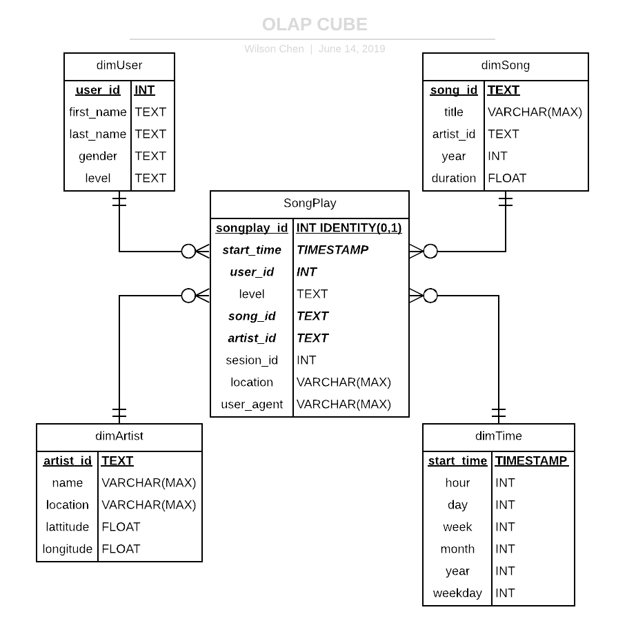

# Data Warehouse and OLAP CUBE on AWS Redshift and S3
_________
Sparkify, a startup, wants to analyze the data they've been collecting on songs and user activity on their new music streaming app. 
The goal of this project is to create a data warehouse and the OLAP CUBE(ROLAP) on AWS Redshift that allow analytics team to optimize queries on songplay analysis.

## DataSets
_________
There are two data sets. Both of them are in S3.
Paths to each data set are as follow:
- **Song data:** `s3://udacity-dend/song_data`
- **Log data:** `s3://udacity-dend/log_data`
    - ***Log data json path:*** `s3://udacity-dend/log_json_path.json`

First one is Song Data, each file is in JSON format and contains metadata about a song and the artist of that song. 
`{"num_songs": 1, "artist_id": "ARJIE2Y1187B994AB7", "artist_latitude": null, "artist_longitude": null, "artist_location": "", "artist_name": "Line Renaud", "song_id": "SOUPIRU12A6D4FA1E1", "title": "Der Kleine Dompfaff", "duration": 152.92036, "year": 0}`

Second one is activity log data. Each file is in in JSON format as well.

## ETL Data PipeLine 
_________
**Extract** data from S3 into 2 staging tables in Redshift, staging_events and staging songs.
**Transform** and **Load** data from these two stagings tables into OLAP CUBE tables.

## Data Model / OLAP CUBE Schema
_________

## Example Queriers and Results
_________

**Roll UP** How many Songs is played in each month in 2018?
`SELECT COUNT(*)
FROM songPlay p JOIN dimTime t ON p.start_date = t.start_date
GROUP BY t.month
having t.year = 2018
LIMIT 10`

**Drill Down** How many song is played in 2018 July's each week?
`SELECT COUNT(*)
FROM songPlay p JOIN dimTime t ON p.start_date = t.start_date
GROUP BY t.week
HAVING t.year = 2018 AND t.month = 7
LIMIT 10`

**Slicing** How many femals are free users?
`SELECT COUNT(*)
FROM songPlay p JOIN dimUser u ON p.user_id = u.user_id
WHERE u.gender = 'M' AND u.level = 'free'
LIMIT 10`

**Dicing** Which song has been listened the most times during Summer(June - August)?
`SELECT COUNT(*)
FROM songPlay p JOIN dimTime t ON p.start_date = t.start_date
GROUP BY p.song_id
HAVING t.month in (6,7,8)
LIMIT 10`
